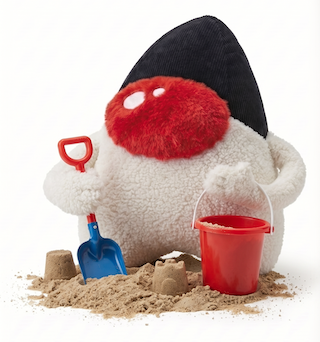

# vavi-commons-sandbox

🔧 Many Utilities

## 🧰 Contents

### 🔧 Mime Utility

to be deprecated

### 🔧 Ant Tasks

to be deprecated

 * Diff
 * File Properties
 * InOut
 * iAppli pak

### 🔧 Java Parser

to be deprecated

### 🔧 Utility

 * Holiday Provider
   * iCal version
   * google calendar cloud api version
   * calculated version
 * Password Field
 * Singleton

### 🔧 GNU Diff

### 🔧 XML

### 🔧 Ansi Color

### 🔧 Grep

to be deprecated

### 🔧 Dynamic Morphism

wip

## Install

 * [maven](https://jitpack.io/#umjammer/vavi-commons-sandbox)

## TODO

 * regex find group iteration
 * mime types
   * https://www.iana.org/assignments/media-types/media-types.xhtml
 * mac finder alias
   * https://en.wikipedia.org/wiki/Alias_(Mac_OS)

---

image designed by @umjammer, drawn by nano banana
